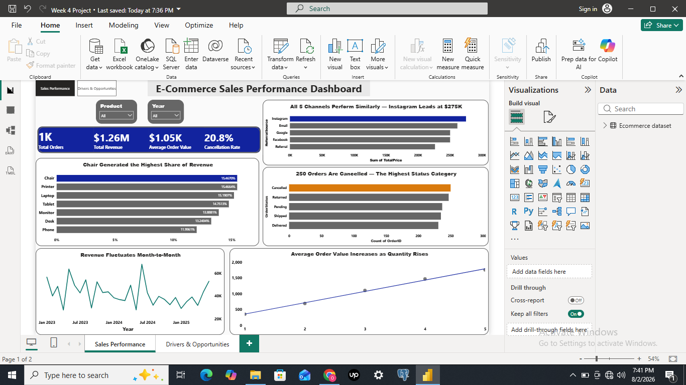
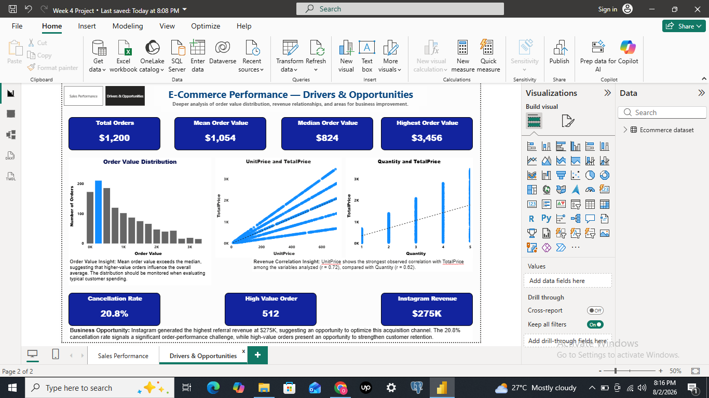

# E-Commerce-Sales-Performance-Dashboard
Interactive two-page Power BI dashboard analyzing sales performance, order value drivers, customer purchasing patterns, and business opportunities.

# Overview
This project uses Power BI to transform the data cleaning, exploratory data analysis, and SQL analysis completed in Projects 1–3 into an interactive business intelligence dashboard. The goal was to move beyond static reports and build a two-page report that enables a business user to explore sales performance and investigate the underlying drivers of order value independently.

**Central business question:** What factors drive revenue and order performance in this e-commerce business, and where are the biggest opportunities for improvement?

# Tools Used

Power BI Desktop (Data Modeling, DAX measures, Slicers, Cross-Filtering, Multi-Page Report Design)

# Dataset

The dataset was cleaned in Project 1 and carried through Projects 2 and 3 before this dashboard. It contains 1,200 rows and 14 columns: OrderID | Date | CustomerID | Product | Quantity | UnitPrice | ShippingAddress | PaymentMethod | OrderStatus | TrackingNumber | ItemsInCart | CouponCode | ReferralSource | TotalPrice

# Dashboard Structure

**Page 1 — Sales Performance**

The first page provides a high-level view of the business's sales performance and allows users to interact with the report using Product and Year slicers.

**Key Performance Indicators**
- Total Orders: 1,200
- Total Revenue: $1.26M
- Average Order Value: $1.05K
- Cancellation Rate: 20.8%

**Visuals**
- Revenue Share by Product
- Revenue by Referral Source
- Order Status Breakdown
- Revenue Trend Over Time
- Average Order Value by Quantity

**Key Insights**

a. Product performance:
Chair generated the highest share of total revenue at approximately 15.47%, closely followed by Printer at 15.46% and Laptop at 15.19%. Revenue is relatively well distributed across the product categories, with Phone recording the lowest share at approximately 11.96%.

b. Referral source performance:
Instagram generated the highest referral revenue at approximately $275K. However, the five referral channels performed within a relatively similar range, suggesting that revenue generation is not heavily dependent on a single acquisition source.

c. Order status:
Cancelled orders were the largest order-status category, with 250 cancelled orders, representing a 20.8% cancellation rate. This highlights cancellations as a key order-performance challenge that warrants further investigation.

d. Revenue trend:
Monthly revenue fluctuated throughout the period rather than following a consistently increasing pattern. This suggests that the business may benefit from investigating the factors behind month-to-month changes in revenue performance.

e. Quantity and order value:
Average order value increases as quantity increases, indicating a positive relationship between the number of items purchased and the total value of an order.

**Page 2 — Drivers & Opportunities**

The second page moves beyond high-level reporting to examine the underlying patterns that may explain order performance and identify areas for further business investigation.

**Key Performance Indicators**
- Total Orders: 1,200
- Mean Order Value: $1,054
- Median Order Value: $824
- Highest Order Value: $3,456
- Cancellation Rate: 20.8%
- High-Value Orders: 512
- Instagram Revenue: $275K

**Visual Analysis**
1. Order Value Distribution

The distribution of order values shows that the mean order value ($1,054) is higher than the median order value ($824).
This indicates that the distribution is right-skewed, with higher-value orders pulling the average upward. As a result, the median provides a useful representation of the typical order value alongside the mean.

The analysis also identified 512 orders above $1,000, representing approximately 42.7% of all orders. This segment could be explored further to understand customer characteristics, product preferences, and purchasing behaviors associated with higher-value transactions.

2. UnitPrice and TotalPrice Relationship

The analysis found a correlation of approximately r = 0.72 between UnitPrice and TotalPrice. This was the strongest observed correlation among the key numerical variables examined in the project.

Business interpretation:
The relationship suggests that higher-priced products tend to be associated with higher total order values in this dataset. However, correlation does not establish causation, so further analysis would be required before concluding that increasing product prices directly causes revenue growth.

3. Quantity and TotalPrice Relationship

The analysis found a correlation of approximately r = 0.62 between Quantity and TotalPrice. The Power BI visual also shows that the average order value generally increases as the quantity purchased increases.

Business interpretation:
Quantity is positively associated with order value, indicating that customers who purchase more items tend to generate higher-value orders. This could support further investigation into strategies such as product bundles, cross-selling, or quantity-based incentives.

# Business Opportunities

Based on the findings presented in the dashboard, three key areas emerge as potential opportunities for business improvement:

1. Optimize the Instagram Acquisition Channel

Instagram generated the highest referral revenue at approximately $275K, suggesting an opportunity to further evaluate and optimize this acquisition channel.

The business could investigate what makes Instagram customers valuable by examining metrics such as average order value, cancellation rate, customer retention, and purchasing behavior compared with other referral sources.

2. Address the Cancellation Challenge

The 20.8% cancellation rate indicates a significant order-performance challenge.

Further investigation could identify the underlying causes of cancellations and determine whether they are associated with specific products, payment methods, customer behavior, or operational factors. Addressing these causes could help improve order completion and overall sales performance.

3. Strengthen Retention Among High-Value Customers

The analysis identified 512 high-value orders above $1,000, representing approximately 42.7% of all orders.

This segment presents an opportunity to explore targeted customer retention strategies. Further analysis could examine the characteristics and purchasing patterns associated with these high-value orders and inform initiatives designed to encourage repeat purchases and strengthen customer loyalty.

# Key Findings
| Finding                                              | Business Interpretation                                                                                                                                  |
| ---------------------------------------------------- | -------------------------------------------------------------------------------------------------------------------------------------------------------- |
| **20.8% cancellation rate**                          | Indicates a significant order-performance challenge that warrants further investigation.                                                                 |
| **UnitPrice and TotalPrice correlation of r = 0.72** | Higher-priced products are more strongly associated with higher order values than quantity in this dataset.                                              |
| **Quantity and TotalPrice correlation of r = 0.62**  | Larger quantities are also positively associated with higher order values, suggesting potential opportunities for bundling and cross-selling strategies. |
| **512 orders exceed $1,000**                         | Represents a substantial high-value order segment that could support targeted customer retention strategies.                                             |
| **Instagram generated approximately $275K**          | Instagram was the highest-performing referral source, suggesting an opportunity to evaluate and optimize the acquisition channel.                        |
| **Mean order value exceeds median order value**      | The distribution is right-skewed, indicating that a smaller number of higher-value orders influence the overall average.                                 |
| **Revenue fluctuates across months**                 | Further investigation could identify seasonal, product-level, or operational factors contributing to monthly revenue variation.                          |

# Skills Demonstrated

Power BI Desktop | DAX | KPI Design | Interactive Dashboards | Multi-Page Report Design | Slicers | Cross-Filtering | Data Visualization | Business Intelligence | Data Storytelling | Correlation Analysis | Business Opportunity Identification

# Project Deliverables
- Two-page interactive Power BI dashboard (.pbix)
- Sales Performance dashboard
- Drivers & Opportunities dashboard
- KPI analysis
- Business insights and opportunities
- Dashboard screenshots for portfolio viewing

# Files

- [`Ecommerce_Dashboard.pbix`](./Ecommerce_Dashboard.pbix) — Interactive Power BI dashboard
- [`Dashboard Page 1 — Sales Performance`](./images/Dashboard_Page1_Sales_Performance.png) — Dashboard preview
- [`Dashboard Page 2 — Drivers & Opportunities`](./images/Dashboard_Page2_Drivers_Opportunities.png) — Dashboard preview

# Related Projects

This dashboard is the final stage of a four-part e-commerce analytics project:

1. [Project 1 — E-commerce Data Cleaning using Microsoft Excel](https://github.com/Omowumi-A/ecommerce-data-cleaning)
2. [Project 2 — E-commerce Exploratory Data Analysis](https://github.com/Omowumi-A/ecommerce-exploratory-data-analysis)
3. [Project 3 — E-commerce SQL Analysis using PostgreSQL](https://github.com/Omowumi-A/ecommerce-sql-analysis)
4. **Project 4 — E-commerce Sales Performance Dashboard** *(this project)*

